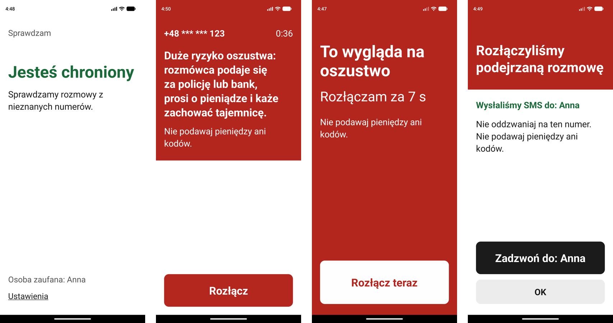
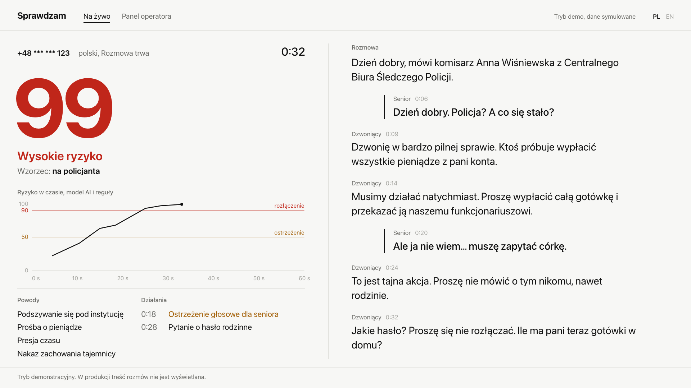
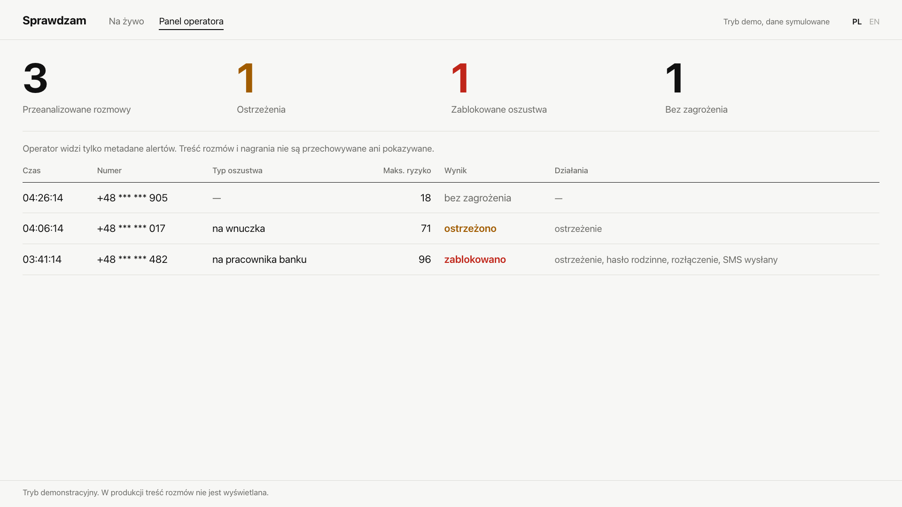

# Sprawdzam (Second Ear)

Ochrona seniorów przed oszustwami telefonicznymi „na wnuczka”, „na policjanta” i „na pracownika banku”, w czasie rzeczywistym, w trakcie rozmowy. Projekt na HackYeah 2026 (zadanie Defence).

## Problem

W 2023 roku policja odnotowała ponad 14 tys. oszustw metodą „na wnuczka” i „na policjanta”; większość ofiar ma ponad 70 lat (Kwartalnik Policyjny 4/2025). Oszust działa w trakcie jednej rozmowy, często w kilka minut. Ostrzeżenia w kampaniach społecznych nie pomagają w chwili, gdy ktoś pod presją mówi „proszę nikomu nie mówić”.

## Rozwiązanie

1. Rozmowa z **numeru spoza kontaktów** trafia do Sprawdzam, a rozmowy z kontaktami dzwonią normalnie i nikt ich nie analizuje.
2. Mowa jest na bieżąco zamieniana na tekst (Whisper), a model decyzyjny basal-1 razem z regułami słów kluczowych ocenia ryzyko oszustwa.
3. Przy średnim ryzyku (wynik ≥ 50 dwa razy z rzędu) senior słyszy ostrzeżenie. Przy wysokim system prosi o hasło rodzinne, rozłącza oszusta i powiadamia osobę zaufaną SMS-em; po rozłączeniu apka proponuje „Zadzwoń do: {osoba zaufana}” (rada policji: rozłącz się i oddzwoń do bliskich na znany numer).
4. Rozłączyć może tylko model, nie same słowa kluczowe: wynik **modelu** ≥ 90 dwa razy z rzędu **oraz** jeden z sygnałów: model widzi prośbę o zachowanie tajemnicy (≥ 0,8) albo prośbę o pieniądze (≥ 0,5), albo trafiła reguła słów kluczowych. Bez ustawionego hasła rodzinnego apka odlicza 8 s z przyciskiem „Rozłącz teraz”.

## Dwa modele wdrożenia

| | **B2B: operator komórkowy** (główny kierunek) | **B2C: aplikacja + przekierowanie** (dodatek, na nim robimy demo) |
| --- | --- | --- |
| Skąd audio | Moduł Sprawdzam na serwerach operatora dostaje kopię dźwięku rozmów z nieznanych numerów (sieć VoLTE/IMS) | Telefon odrzuca nieznany numer, operator przekierowuje go „gdy zajęte” na numer usługi, senior odbiera w aplikacji |
| Co instaluje senior | Nic, włącza usługę u operatora | Aplikację na Androida |
| Alerty | SMS z sieci operatora | SMS wysyłany z telefonu seniora |
| Status | **Zaprojektowane, nie zbudowane** (`docs/ARCHITECTURE.md`) | Backend i aplikacja zbudowane; przekierowanie od prawdziwego operatora nietestowane, w demo zastępuje je symulator sieci |

## Jak to działa (demo)

```
Symulator sieci operatora          Backend (FastAPI, MacBook)                        Telefon seniora (Android)
 /dev/caller w przeglądarce  ──►   μ-law 8 kHz → PCM 16 kHz → cięcie po pauzach  ◄══► aplikacja: połączenie,
 (nagrany skrypt oszusta           → Whisper large-v3-turbo (lokalnie)                  pasek ryzyka, hasło
  albo mikrofon)                   → basal-1.0-4.5B + reguły → wygładzanie              rodzinne, SMS do osoby
                                   → ostrzeżenie / hasło rodzinne / rozłączenie         zaufanej
                                   → /dev/jury: ekran na projektor
```

- Oba modele działają **lokalnie na Macu**; treść rozmowy nie trafia do żadnej zewnętrznej usługi AI.
- Twilio jest podłączone przez adapter, ale w demo działa w trybie dry-run (nic nie dzwoni i nie płaci).
- Jeśli model decyzyjny nie działa, zostają reguły słów kluczowych (mogą ostrzec, nie rozłączą). Jeśli backend jest nieosiągalny, aplikacja pokazuje „Ochrona chwilowo niedostępna”, a z prawdziwą telefonią połączenie ma przejść do seniora bez ochrony (fail-open).

| Apka seniora | Ekran dla jury | Panel operatora |
| --- | --- | --- |
|  |  |  |

Wszystkie zrzuty: [`docs/screenshots/`](docs/screenshots/README.md).

## Prywatność

- Nie zapisujemy audio ani transkrypcji: są tylko w pamięci RAM na czas rozmowy. Logi zawierają identyfikatory, wyniki i kategorie, bez treści rozmowy i z zamaskowanymi numerami.
- Dzwoniący przed połączeniem słyszy, że rozmowa jest chroniona i sprawdzana, ale nie nagrywana.
- **Nie rozpoznajemy emocji ani biometrii głosu** (AI Act: rozpoznawanie emocji z głosu to system wysokiego ryzyka). Model widzi tylko tekst z ostatnich ok. 60 s rozmowy.
- Ekran dla jury pokazuje treść rozmowy wyłącznie w trybie demonstracyjnym; widok operatora pokazuje alerty bez treści.

## Co jest zbudowane, a co zaprojektowane

„Uruchomione na żywo” = zespół przeprowadził to 4.10 na prawdziwym sprzęcie: Samsung S21+ (Android 15) jako telefon seniora, iPhone jako „oszust” przez tunel Cloudflare, MacBook z modelami i ekranem dla jury.

| Element | Status |
| --- | --- |
| Backend: odbiór strumienia audio, konwersja, segmentacja, klient Whisper, ocena ryzyka (basal-1 + reguły + wygładzanie), eskalacja, przekazywanie dźwięku do aplikacji (protokół v0), zabezpieczenia kosztów telefonii | Zbudowane, 498 testów (`uv run pytest`), uruchomione na żywo |
| Analiza wypowiedzi seniora z filtrem echa (głośnik telefonu wraca do mikrofonu) | Zbudowane, uruchomione na żywo (w jednej rozmowie odrzucone 17 fragmentów echa, 3 przycięte) |
| Hasło rodzinne z odliczaniem 12 s; bez ustawionego hasła odliczanie 8 s z przyciskiem „Rozłącz teraz”; rozłączenie przez seniora przy wysokim ryzyku liczy się jako blokada | Zbudowane; hasło uruchomione na żywo, wariant bez hasła sprawdzony na emulatorze i w testach, jeszcze nie na fizycznym telefonie |
| SMS do osoby zaufanej wysyłany z telefonu seniora (jeden na rozmowę), po blokadzie przycisk „Zadzwoń do: {osoba zaufana}” | Zbudowane, prawdziwy SMS doszedł na telefon zespołu |
| Fail-open: apka pokazuje „Ochrona chwilowo niedostępna”, gdy backend jest nieosiągalny | Zbudowane, widziane na żywo (zerwane połączenie USB). Przełączenie dzwoniącego na numer seniora przez Twilio zbudowane, nietestowane z prawdziwym połączeniem |
| Ekran dla jury `/dev/jury` z zakładką „Panel operatora” (alerty bez treści rozmów) | Zbudowane, uruchomione na żywo |
| Symulator sieci operatora `/dev/caller`, zastępcza aplikacja `/dev/senior`, import własnych nagrań głosu | Zbudowane |
| Aplikacja React Native 0.77.1, moduł natywny CallEngine w Kotlinie (Android) | Zbudowane, uruchomione na żywo |
| Ewaluacja na 300 syntetycznych rozmowach PL/EN | Zbudowane, wyniki w `server/bench/eval/RESULTS.md` |
| Port aplikacji na HarmonyOS (RNOH 0.77.75, moduły ArkTS) | Zbudowane i uruchomione na emulatorze, **rozwój wstrzymany** (4.10) |
| Moduł u operatora (IMS/SIPREC), sygnały o kampaniach oszustów, routing pilotażu B2C na wspólny numer, odrzucanie nieznanych numerów w telefonie | Zaprojektowane, nie zbudowane (`docs/ARCHITECTURE.md`, sekcje 7 i 8) |

## Wyniki ewaluacji (dane syntetyczne)

300 rozmów (150 oszustw, 150 zwykłych, w tym 115 trudnych, np. syn naprawdę pożycza pieniądze). **Rozmowy napisał model językowy (Claude)**, więc to optymistyczne oszacowanie, a nie wynik z prawdziwych połączeń.

| System | Precyzja (ostrzeżenie) | Czułość (ostrzeżenie) | Odsetek fałszywych alarmów |
| --- | --- | --- | --- |
| Same reguły | 0,92 | 0,61 | 0,05 |
| basal-1.0-4.5B | 0,97 | 0,97 | 0,03 |
| max(basal-4.5B, reguły), tak działa backend | 0,93 | 1,00 | 0,07 |

Wiersze mierzą próg ostrzeżenia. Dla rozłączenia (≥ 90) ewaluacja nie była powtórzona dla obecnej zasady: najbliższy jej wariant z `RESULTS.md` to „hang-up: model ≥ 90 (rules can only warn)”, czułość 0,89 i 1 fałszywe rozłączenie na 150 zwykłych rozmów (1%). Obecna zasada wymaga jeszcze sygnału tajemnicy, pieniędzy albo reguły, więc może tylko obniżyć obie liczby.

Szczegóły, odczyty tura po turze i przykłady błędów: `server/bench/eval/RESULTS.md`, `docs/AI_FEATURES.md`.

## Uruchomienie demo od zera (Mac z Apple Silicon)

Krok po kroku przed pokazem: [`docs/DEMO_CHECKLIST.md`](docs/DEMO_CHECKLIST.md).

Wymagania: Homebrew `whisper-cpp`, `ffmpeg`, `uv`, `huggingface-cli`, `cloudflared`, `adb`; ok. 15 GB miejsca na modele; do aplikacji Node 22, Android SDK i JDK 21 (szczegóły w `app/README.md`).

**Jednorazowo:**

```bash
server/bench/download-models.sh        # Whisper large-v3-turbo + basal-1.0-4.5B + silnik basal z naszą łatką (ok. 11 GB)
cd server && uv sync && cd ..
cp .env.example server/.env.dev        # ustaw w nim:
#   DEV_TOOLS=true  TELEPHONY_DRY_RUN=true
#   APP_DEVICE_TOKEN=<losowy ciąg, min. 16 znaków; ten sam w aplikacji>
#   FAMILY_PASSWORD=<3–12 cyfr, tylko na demo; puste = odliczanie 8 s bez hasła>
#   WHISPER_URL=http://127.0.0.1:8080  DECISION_BACKEND=basal  BASAL_URL=http://127.0.0.1:8000
```

**Aplikacja na telefonie z Androidem** (podłączonym przez USB; fizyczny telefon z kartą SIM, bo tylko on wyśle prawdziwy SMS):

```bash
app/scripts/install-demo-android.sh --serial <SERIAL>   # release APK z wbudowanym JS, uprawnienia, adb reverse, start
```

W aplikacji wpisz ten sam `APP_DEVICE_TOKEN` (Ustawienia → Developer) i wybierz osobę zaufaną (Ustawienia; apka poprosi wtedy o zgodę na SMS); ekran główny ma pokazać „Jesteś chroniony”.

**Start demo jedną komendą:**

```bash
scripts/demo-up.sh       # modele (:8080, :8000), backend (:8765), adb reverse + strażnik USB, tunel Cloudflare,
                         # otwiera /dev/?base=<tunel> (kod QR dla iPhone'a „oszusta”) i /dev/jury (projektor)
scripts/demo-down.sh     # zatrzymuje tunel, strażnika USB i backend; --all zatrzymuje też modele
```

| Adres | Kto | Co |
| --- | --- | --- |
| `https://….trycloudflare.com/dev/caller` (z kodu QR) | iPhone „oszusta” | Symulator sieci operatora: wybór nagranego skryptu albo mikrofon, przycisk „Zadzwoń” |
| `http://127.0.0.1:8765/dev/jury` | Projektor | Transkrypcja obu stron, wykres ryzyka z progami 50 i 90, powody, działania; zakładka „Panel operatora” bez treści rozmów |
| `http://127.0.0.1:8765/dev/senior` | Zapas | Przeglądarkowa wersja aplikacji seniora, gdy telefon zawiedzie |

Skrypty rozmów można nagrać własnym głosem: `server/scripts/import_recording.sh`, instrukcja w [`server/scripts/samples/NAGRANIA.md`](server/scripts/samples/NAGRANIA.md). Ekran telefonu na projektor: `scrcpy`. Plan B: nagranie wideo demo.

<details>
<summary>Ręcznie, bez skryptów</summary>

```bash
server/bench/run-whisper.sh                           # terminal 1: http://127.0.0.1:8080
server/bench/run-basal.sh                             # terminal 2: http://127.0.0.1:8000 (ok. 10 GB RAM)
cd server
scripts/make_prompts.sh && scripts/make_samples.sh    # jednorazowo: komunikaty głosowe i skrypty (macOS `say`)
scripts/run_dev.sh --env .env.dev                     # terminal 3; sprawdź http://127.0.0.1:8765/health
adb reverse tcp:8765 tcp:8765                         # telefon widzi backend jako localhost:8765
cloudflared tunnel --url http://127.0.0.1:8765        # terminal 4; adres https://….trycloudflare.com dla iPhone'a
```

Safari wymaga HTTPS do mikrofonu, stąd tunel. Twilio nie jest potrzebne: bez `TWILIO_AUTH_TOKEN` webhooki Twilio są odrzucane, a symulator dzwoni przez `/dev/calls`. Adres backendu w aplikacji (Ustawienia → Developer): `ws://localhost:8765/app/control` po `adb reverse` albo `wss://….trycloudflare.com/app/control`.

</details>

## Testy i ewaluacja

```bash
cd server && uv run pytest                 # testy backendu, bez sieci i bez modeli
cd server && uv run pytest -m live         # opcjonalnie: z działającymi serwerami modeli
cd app && npm test && npm run typecheck    # aplikacja

# ewaluacja (z katalogu głównego repo, przy działającym basal-serve na :8000)
uv run scenarios/generator/generate.py --stats
uv run server/bench/eval/run_eval.py collect --url http://127.0.0.1:8000 --name basal-4.5B
uv run server/bench/eval/run_eval.py report
```

Pełna lista poleceń (model 1.5B, widok tylko dzwoniącego, tura po turze): `server/bench/eval/RESULTS.md`, sekcja „Reproduce”.

## Ograniczenia

- **Dane syntetyczne.** Ewaluację przeprowadziliśmy na rozmowach napisanych przez model językowy, a Whisper testowaliśmy na mowie syntezowanej przez telefoniczny filtr, nie na prawdziwych połączeniach z głosami starszych osób.
- **Brak umowy z operatorem.** Wariant B2B jest projektem; nie testowaliśmy dostępu do audio w sieci IMS ani przekierowania od polskiego operatora.
- **Tylko polski i angielski.** Język rozpoznawania mowy jest wymuszony z ustawień seniora.
- **Modele lokalnie na Macu.** Demo działa na jednym komputerze (M4 Pro, 48 GB RAM): kilka rozmów naraz, bez wysokiej dostępności.
- **Jedno urządzenie seniora na backend** (protokół v0), progi nie strojone na osobnym zbiorze danych.

## Dokumentacja

- [`docs/DEMO_CHECKLIST.md`](docs/DEMO_CHECKLIST.md): lista kontrolna przed pokazem
- [`docs/DLA_PITCHU.md`](docs/DLA_PITCHU.md): ściąga dla osób od prezentacji
- [`docs/ARCHITECTURE.md`](docs/ARCHITECTURE.md): architektura, wdrożenie u operatora, pilotaż B2C (EN)
- [`docs/AI_FEATURES.md`](docs/AI_FEATURES.md): modele, przepływ danych, prywatność, walidacja (EN)
- [`docs/APP_PROTOCOL.md`](docs/APP_PROTOCOL.md): protokół backend ⇄ aplikacja (EN)
- [`AI_WORKFLOW.md`](AI_WORKFLOW.md): jak używaliśmy AI przy budowie (EN)
- `server/README.md`, `server/bench/README.md`, `app/README.md`, `scenarios/README.md`: szczegóły techniczne (EN)

## Użycie AI i usług zewnętrznych

- **W produkcie:** Whisper large-v3-turbo (OpenAI, MIT, przez whisper.cpp) i basal-1.0-4.5B (`Remek/basal-1.0-4.5B`, Apache 2.0, na bazie Bielika); oba uruchamiane lokalnie. Twilio za adapterem, w demo w trybie dry-run. Cloudflare Quick Tunnel tylko do demo.
- **Przy budowie:** Claude (Anthropic) i Claude Code, opis w `AI_WORKFLOW.md`. Rozmowy testowe w `scenarios/` napisał model językowy.

## Licencje

Backend ma w `server/pyproject.toml` licencję Apache-2.0, zbiór `scenarios/` jest na CC BY 4.0. Wagi modeli nie są w repozytorium i mają własne licencje (patrz wyżej). Materiały organizatorów i skille Huawei nie są dołączone.
